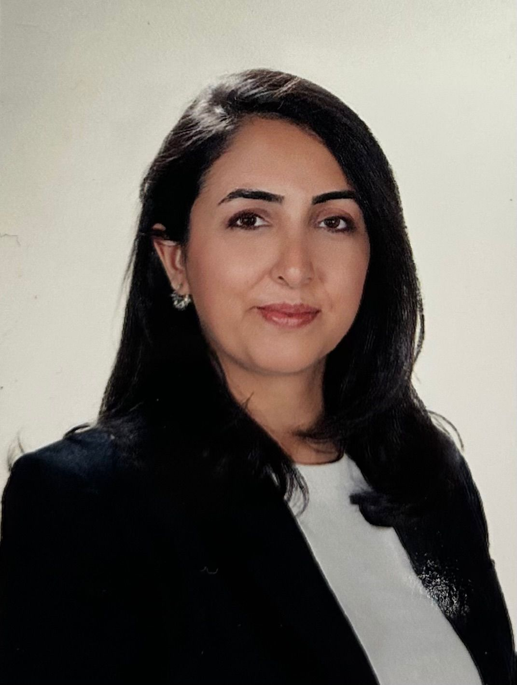

{width="140"}

# Education

-   B.S., Dokuz Eylül University, Turkey, 2008-2013
-   B.S.(Erasmus), Vienna University of Technology, Austria, 2011-2012
-   M.S., Industrial Engineering, Hacettepe University, Turkey, 2025 - ongoing.

# Work Experience

## Employements

1.  ASELSAN, Project Engineer, 2020-Present

2.  Eczacıbaşı, Material Planning Engineer, 2019-2020

3.  Ford Otosan, Production Planning Engineer, 2013-2019

## Internships

1.  Vestel Elektronik, Part Time Project Engineer, 2012-2013

2.  Hayes Lemmerz, Intern, 2011

# Projects

1.  3700 SK2 Radio Family: An In-house R&D Project (Aselsan-2024)
2.  Decreasing Paint Shop Inefficiencies via Vehicle Sequencing (Ford Otosan-2018)

# Competencies

Microsoft Office, SAP, Minitab, Primavera, R, Quarto, Git

# Hobbies

Tennis 🎾, painting 🎨, travelling 🌄

# CV

[Burcu Barış CV](docs/Burcu_Baris_CV.pdf)

